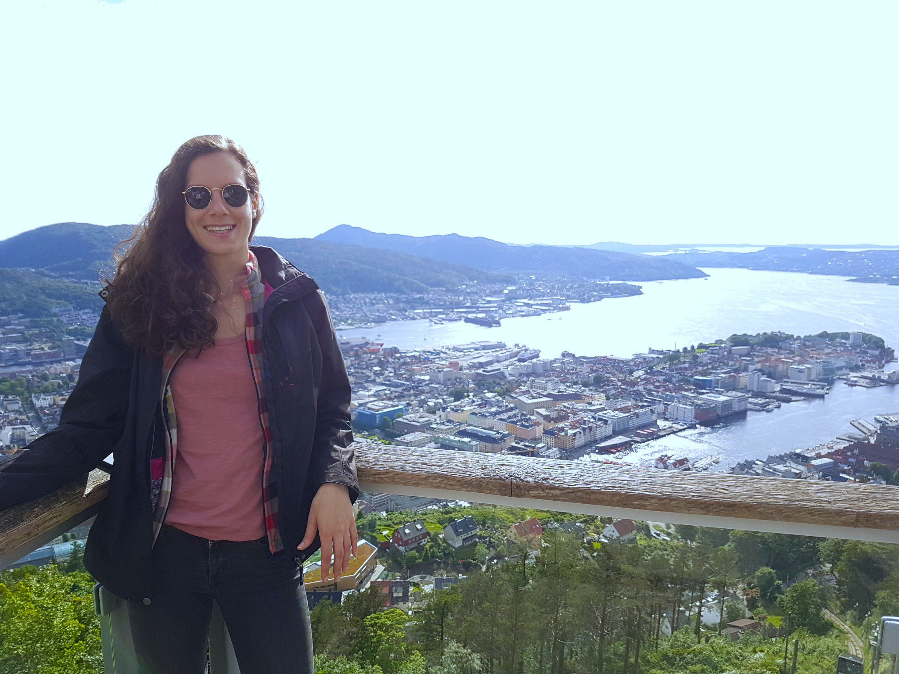

 # Rita Laezza

## About me

I'm a PhD student at [Chalmers University of Technology](https://www.chalmers.se/en/Pages/default.aspx) in the [Mechatronics group](https://www.chalmers.se/en/departments/e2/research/systems-and-control/Pages/Mechatronics.aspx), within the division of Systems and Control. My research topic consists of robotic manipulation of deformable objects using learning-based methods. My position is funded by the Knut and Alice Wallenberg Foundation, as part of the [Wallenberg AI, Autonomous Systems and Software Program (WASP)](https://wasp-sweden.org/). I previously also completed my Master studies at Chalmers, where I did my thesis work within the [Biomechatronics and Neurorehabilitation Lab](http://www.bnl.chalmers.se/wordpress/). My focus was on implementing Deep Learning methods for myoelectric control, which has applications in robotic prosthetics and neuromuscular rehabilitation.

## PhD Details

I started my graduate studies in February, 2019 after working for a little over a year as an engineering consultant at [i3tex](https://www.i3tex.com/). My research project lies at the intersection of machine learning, robotics and automatic control. My aim is to specialize in AI and learning-based approaches for control, emphasizing on the robotic manipulation of deformable objects.

### Supervisors

Main Supervisor: [Yiannis Karayiannidis](http://yiannis.info/)
Co-Supervisor: [Florian Pokorny](http://www.csc.kth.se/~fpokorny/)

### Project Description

Modern robotic applications require handling of deformable objects. In industrial settings, a multitude of deformable objects is encountered, ranging from foams and padding of variable stiffness to plastic parts that need to be snapped into a fixture, etc. Similarly, there are numerous potential applications of deformable object manipulations in fields ranging from agriculture to medicine such as robotic surgery. The main goal of my research project is to deal with the manipulation of deformable objects by combining i) data-driven modeling of robot-object interaction based on Deep Neural Networks and vision/force data, and ii) design of control policies based on Reinforcement Learning principles.

### Graduate Courses

- Deep learning and GANs (WASP)
- Graphical Models, Bayesian Learning and Statistical Relational learning (WASP)
- Learning Theory and Reinforcement Learning (WASP)

### Teaching Duties

- [Linear Control System Design](https://student.portal.chalmers.se/en/chalmersstudies/courseinformation/Pages/SearchCourse.aspx?course_id=22002&parsergrp=3)
- [Model Predictive Control](https://student.portal.chalmers.se/en/chalmersstudies/courseinformation/pages/searchcourse.aspx?course_id=28600&parsergrp=3)

## Completed Education

- 2018, **MSc. Biomedical Engineering**, *Chalmers University of Technology*
- 2015, **BSc. Biomedical Engineering**, *Polytechnic Institute of Porto*

### Minor education

- 2019, [Reinforcement Learning Summer SCOOL](https://rlss.inria.fr/)
- 2019, [Robotics Craftsmanship International Academy](https://robotcraft.ingeniarius.pt/)
- 2018, [Responsible Robotics and AI – IDEA League Summer School](https://responsiblerobotics.org/event/idea-league-summer-school/)

## Publications

- Amado Laezza, Rita. *Deep Neural Networks for Myoelectric Pattern Recognition - An implementation for multifunctional control*. MSc thesis. 2018. [(link)](https://odr.chalmers.se/bitstream/20.500.12380/254980/1/254980.pdf)

## Contact

**Email:** <laezza@chalmers.se>
